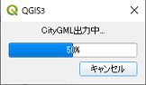

# CityGMLモデル生成プラグイン 利用マニュアル

## 起動

プラグインメニューから「CityGMLモデル生成ツール」をクリックします。
 
すると、下記のようなダイアログ画面が表示されます。

## ダイアログ画面詳細

|    |    |
| ---- | ---- |
| ベースデータ読み込み |  |
| フォルダ選択ボタン | 変換元ファイル（シェープファイルまたは基盤地図(xml)）があるフォルダを指定します。 |
| 読み込みボタン | 指定したフォルダにあるファイルを読み込みます。 |
| 必須項目 | 出力時のgml:idになる項目を指定します。読み込み後、属性名のコンボボックスが表示されます。 |
| 属性情報読み込み |  |
| 地物データの属性を使用 | 地物データの属性から項目を指定します。 |
| 高さフィールド | 出力時の地物の高さ（measuredHeight）になる項目を指定します。ベースデータ読み込み後、属性名のコンボボックスが表示されます。 |
| 外部CSVの属性を使用 | 下記で指定するCSVファイルから項目を指定します。 |
| ファイル選択ボタン | 属性名が記載されたCSVフォルダを指定します。 |
| 読み込みボタン | 指定したCSVファイルを読み込みます。 |
| 高さフィールド | 出力時の地物の高さ（measuredHeight）になる項目を指定します。CSVファイル読み込み後、属性名のコンボボックスが表示されます。 |
| リンクキー | 開発中 |
| 属性設定ボタン | 開発中 |
| CityGML |  |
| 出力フォルダ選択ボタン | 生成したgmlファイルを出力するフォルダを指定します。 |
| 出力ボタン | CityGML生成および出力処理を実行します。 |

## ベースデータ読み込み

変換元ファイル（シェープファイルまたは基盤地図(xml)）を指定し読み込みます。 
「フォルダ指定」ボタンをクリックし、フォルダを指定します。次に、「読み込み」ボタンをクリックします。 
すると、下記のように、必須項目と高さフィールド欄に地物の属性名が表示されます。

## 属性情報読み込み

### 地物データの属性を使用

出力時の地物の高さ（measuredHeight）になる項目を指定します。 
該当属性項目がない場合は未設定にします。 

### 外部CSVの属性を使用

属性名が取得できない場合などは、下記のように、CSVファイルを読み込み、項目を指定します。 
CSVファイルは単純に属性名がカンマ区切りのものです。

## CityGML

CityGML生成および出力処理を実行します。出力後にファイル検査も実施します。 
「出力フォルダ選択」ボタンをクリックして出力フォルダを指定し、
「出力」ボタンをクリックして実行します。

出力フォルダに既存のファイルがある場合は、下記のようなメッセージが表示されます。（出力されません。）

出力フォルダ決定後、CityGMLの地物タイプ設定画面が表示されます。 
該当タイプを指定し、「OK」ボタンをクリックします。

|    |    |
| ---- | ---- |
| FeatureType | 出力するCityGMLファイルの地物タイプを指定します。下記から選択できます。 ・bldg:Building ・luse:LandUse ・tran:Road  |
| ファイル名 | 出力するCityGMLファイルのファイル名形式です。（変更はできません。） |

処理が開始されると、下記のようなステータスバーが表示されます。

終了すると、下記のようなメッセージが表示されます。

QGIS側に生成したメッシュ単位でのCityGMLレイヤーが表示されます。

続けて、検査結果を出力するフォルダ選択画面が表示されます。検査については下記「検査内容」を参照ください。 
指定しない場合は、検査されません。

検査処理中は、下記のようなステータスバーが表示されます。

## 検査内容

生成したCityGMLファイルの完全性や一貫性などをファイル単位で検査し、結果を出力します。 
検査内容は下記を参考にしています。 
3D都市モデル標準製品仕様書（ https://www.mlit.go.jp/plateau/file/libraries/doc/plateau_doc_0001_ver01.pdf ）

検査が終了し、すべてのファイルで問題ない場合は下記のような【合格】メッセージが表示されます。

合格したgmlファイルの検査結果は、指定したフォルダ配下の合格フォルダに出力されます。

いずれかのgmlファイルで不合格があった場合は、下記のようなメッセージが表示されます。

不合格があったgmlファイルの検査結果は、指定したフォルダ配下の不合格フォルダに出力されます。

