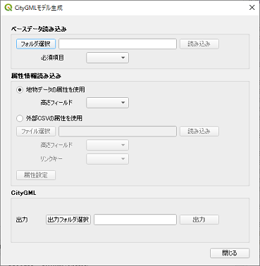

# CityGMLモデル生成プラグイン

作成されている地図のテーマを編集するQGISプラグインです。 
Shapeファイルや基盤地図(xml)を読み込み、高さを設定して、CityGMLを出力します。  
出力したCityGMLの内容の検査もします。

## 概要

### ウィジェット画面

### 出力結果

例）

### 検査結果

例）

## 利用方法

利用方法については、[使い方](./MANUAL.md)をご確認ください。

## ライセンス

本ツールは GNU GENERAL PUBLIC LICENSE v2 ライセンスが設定されています。[GNU GENERAL PUBLIC LICENSE Version 2, June 1991](https://www.gnu.org/licenses/old-licenses/gpl-2.0.txt)
